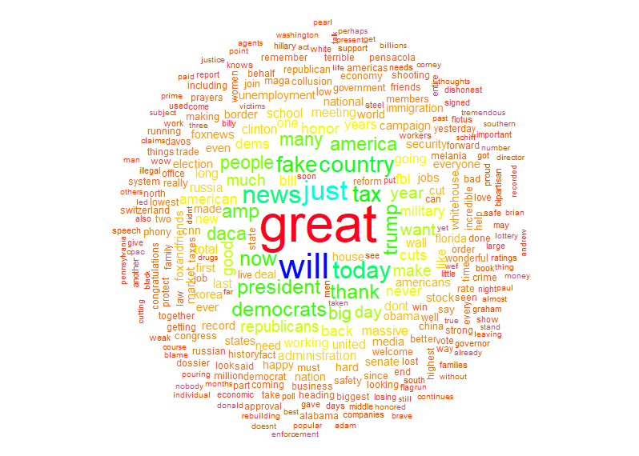

[](http://quantlet.de/)

## [](http://quantlet.de/) **SPL_FreqTrump** [](http://quantlet.de/)

```yaml


Name of Quantlet : SPL_FreqTrump

Published in : SPL

Description : 'A frequency plot of Donald Trumps most used words in his Tweets in the period the 7th of septemper 2017 to the 2nd of February 2018'

Keywords : 
- text mining
- frequency
- ggplot2
- student
- visualisation
- statistics

Author : Asbjoern Kamp Johannesen

Submitted : Wed, February 21 2018 by Asbjoern Kamp Johannesen

Datafile : 'TrumpTweets.Rdata'

```




### R Code:
```r

rm(list = ls())

# Setup authorization for twitter
require("twitteR")
consumerKey = "OzPjAMbWrU3P9mj2G1IP6uTDo"
consuemrSecret = "KOc6nB1nuUEYt1OPgkstbs6m7nJjjkFMTXK3GOg1nenPynhavZ"
accessToken = "3032742052-DBynC4JFEChlKnmbnDvTRstaEofU8XoRPdA7lQJ"
accessTokenSecret = "6H8zTIijSqKAnWDVo5YQ0tZnErEJxuTQShQ7pOavEC8ij"
setup_twitter_oauth(consumerKey, consuemrSecret, accessToken, accessTokenSecret)
1

# Geet Trumps Tweets (Max limit 3200: 418 own tweets, the rest is Trumps retweets) + make data frame
trump.tweets = userTimeline("realDonaldTrump", n = 3200, excludeReplies = FALSE, includeRts = FALSE)
df = do.call("rbind", lapply(trump.tweets, as.data.frame))

#The command above contains the newest Tweets. For exact repliacation of the figure, one needs to use same time span as we did. It this is the case, load this dataframe. If not, skip this part
load("TrumpTweets.Rdata")


#Clean data
df$text = sapply(df$text, function(row) iconv(row, "latin1", "ASCII", sub = ""))
df$text = gsub("(f|ht)tp(s?)://(.*)[.][a-z]+", "", df$text)
require("tidytext")
require("dplyr")
tf = df %>% unnest_tokens(word, text) %>% anti_join(stop_words)

# Plot data
library("ggplot2")
tf %>% count(word, sort = TRUE) %>% filter(n > 10) %>% filter(!word=="amp") %>% mutate(word = reorder(word, n)) %>% ggplot(aes(word, n)) + 
  geom_col() + theme_classic() + xlab(NULL) + ylab(label="Frequency") + coord_flip()
```
